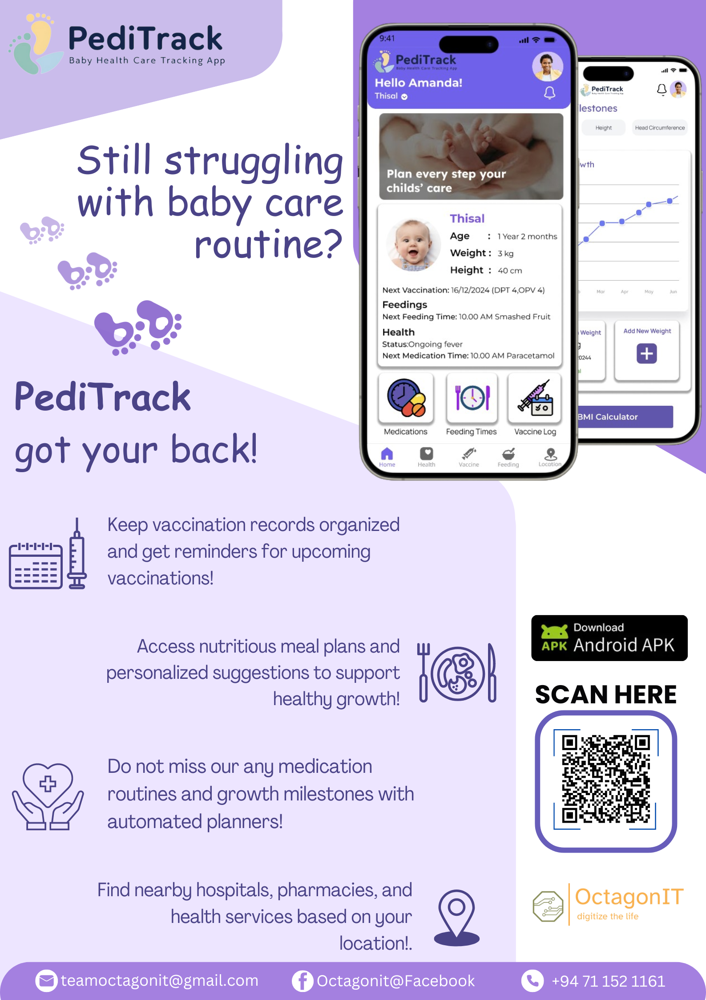

# PediTrack - Baby Health and Nutrition Management App

## Overview

PediTrack is a mobile application designed to assist parents and guardians in managing the health and nutrition of young children. The app focuses on features such as **feeding planning**, **vaccination schedules**, **health facility locator**, and **health record management**. PediTrack aims to provide a comprehensive and convenient way for parents to monitor the growth and health of their children.

The project was developed using **React Native** for cross-platform mobile development, with a backend powered by **Node.js** and **Express.js**, and utilizes **Firebase** for data storage and authentication.

## Key Features

- **Feeding Planner**: Create and manage personalized feeding plans for children, ensuring consistent nutrition.
- **Vaccination Scheduler**: Track vaccination schedules with notifications for upcoming vaccinations, helping parents stay on top of their child’s immunization needs.
- **Health Facility Locator**: Locate nearby hospitals, clinics, and health facilities with integrated maps, making it easy for parents to access healthcare services when needed.
- **Health Record Management**: Keep track of health records, including vaccination history and growth progress, all in one centralized location.

## Mobile Application

  - **Frontend**: React Native, Expo
  - **Backend**: Firestore
  - **Authentication**:  Supabase (Google OAuth)
  - **Cloud Storage**: Firebase
  - **Styling**: NativeWind 

## 🚀 My Contribution

**I have worked on the following parts of PediTrack**:
- **Health record manager**: Developed the health records manger to store all the health records of baby.
- **Medication Tracker**: Integrated medicine record tracking system and medication reminder feature for all medication..
- **Growth Milestones Tracker**: Track the growthmilestones like weight,height,headcircumference and display it a line chart with details.
- **BMI Calculator**: BMI calculator and give the status of the BMI index.

## Application

**You Can Download Android APK here:** [⬇️ Download Android APK](https://expo.dev/artifacts/eas/6CgaMLHUjmS1XE8HMwkVwx.apk)

Or scan this QR code to download:

